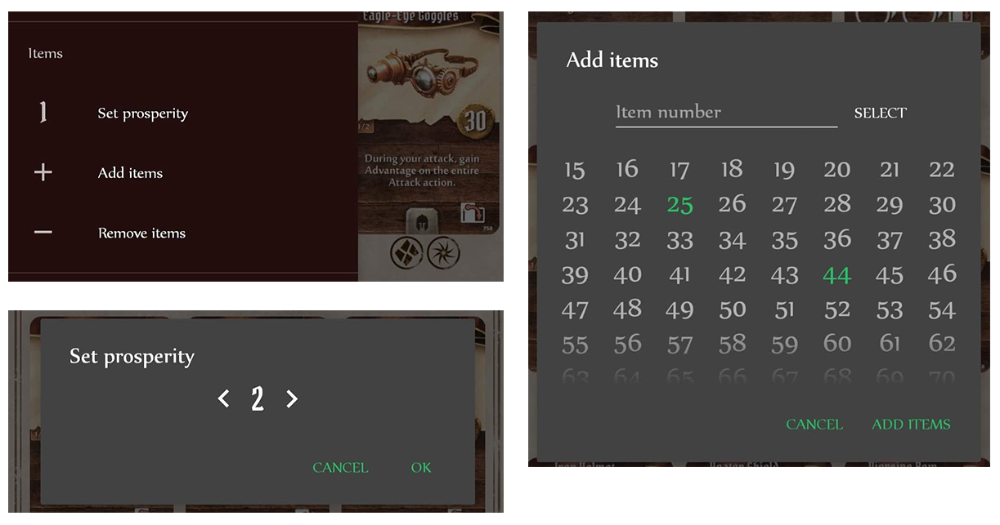

<!--{: .align-center height="15%" width="15%"}-->

## What is it?

<!--{: .align-right width="300px"}-->
<!-- I kinda want an image on the right here to show what the app looks like, but it's hard to make it look good at all widths-->
Gloomhaven Shop is an unofficial Gloomhaven companion app for Android that tracks item availability and ownership. It's particularly useful for people running multiple parties (in one campaign or several) but it's not bad for one-party people either!

{: .align-center width="90%"}

### Features
- Track unlocked items in multiple campaigns
- Remember who has purchased what in multiple parties
- Filter items by equipment slot, use type, or owner
- Quickly retire a character and calculate the profit from selling items
- Export parties to share with your group
- Support for the Forgotten Circles expansion

### Download

Gloomhaven Shop is available on Google Play.

## Usage

On the main screen, all available items of the current party are displayed. To change the number of columns, tap the magnifying glass symbols on the top right.

{: .align-center width="400px"}

Each item card is displayed along with its item number and circles indicating the number of copies of the item - unfilled if available, containing a class icon if purchased. Dots indicate that fewer than the maximum number of the item are unlocked, for instance because a limited number were found in a chest.

### Setting owners

To add or remove an owner, tap the item card, and then the class icon corresponding to your character.

{: .align-center width="300px"}

### Adding items

Gloomhaven's prosperity can be set from the drawer menu, which will add the appropriate items. Items not already unlocked through prosperity can also be added or removed individually. This is done by opening the appropriate dialog from the drawer menu, and either tapping the numbers in the list, or entering them and pressing the "Select" button (or Enter on your keyboard).

<!--
<figure class="half">
    
    
</figure>
-->

{: .align-center width="600px"}

If you receive a limited number of items (for instance from a chest) that you have yet to unlock through prosperity or an item design, the total number of available items of that kind can be adjusted after it's been added by tapping the item card, and then the arrow symbols. If the item is later unlocked through a prosperity increase, the number will automatically be changed to the normal maximum amount.

{: .align-center width="350px"}

Note that removing items, either through decreasing prosperity or by using "Remove items", can remove ownership information about those items from any party belonging to the current campaign. Removing items is really just implemented so that items added by mistake can be removed.

### Filters

<!--{: .align-right width="300px"}-->
To see only a subset of all unlocked items, filters can be applied through the icon on the top right of the main screen.

{: .align-center width="300px"}

The currently existing filters are:

- Equipment slots - all items that match a certain equipment slot. Can be combined to match several.
- Use type - either used, spent, or neither. These too can be combined.
- Ownership - all items that have been purchased by at least one person, all items that have copies left that can be purchased, and all items purchased by a specific character.

### Retiring characters

Characters in the active party can be retired from the drawer menu.

{: .align-center width="300px"}

Select one or more to retire. The gold values displayed are what would be gained from selling all the items they have at the time.

### Party management

All parties and campaigns can be accessed through the option "Parties" in the drawer menu.

{: .align-center width="300px"}

Here, existing campaigns and parties can be renamed and deleted. Campaigns can only be deleted if there is more than one, and parties only if there is at least one other party in that campaign. Pressing back will return to the main screen of the party marked as "active". To choose another party, simply tap that party and then "Select". Finally, parties can be exported (and automatically the campaign they belong to) by tapping "Export" on a party.

### Exporting & importing parties

Parties can be exported either from the Party Selection screen, or via the "Export current party" shortcut in the drawer menu on the main screen. The amount of apps available for sharing is limited, but may improve in the future. When importing a party, simply tap the file wherever you've shared it, and Gloomhaven Shop should open. Again, the number of applications that know how to handle opening the file is limited. As of right now, I've found that Dropbox, Google Drive and GMail work well for exporting and importing. If you get error messages similar to "Couldn't open file" wherever you're trying to open the file, first make sure that the file extension is .ghshop. If that does not work, try opening the file from another application.

My recommendation for using Gloomhaven Shop with others in the same party is to only input changes on one device for a given session, and then exporting the party to a shared Google Drive folder afterwards so that everyone can import the changes.

You can import parties that already exist in your app. If both the party and its campaign already exist, you will be asked to confirm overwriting them. If only the campaign already exists, confirming will import as a new party, but overwrite the campaign. Both of these import types can affect other parties in the same campaign. Be careful not to import an older version of a party and mistakenly decreasing prosperity, for instance - this could cause other parties in the same campaign to lose information about ownership of items locked behind prosperity.

<!--
<figure class="third">
    
    
    
</figure>
-->

Whether an imported party/campaign is the same as an existing one or not is determined by an internal ID that's set when the party is initially created. **If you intend to use multiple devices to track the same campaign or party, make sure you create them on one device and export to the others the first time.** That way, the internal ID will be the same and they will be treated as the same campaign/party for the purposes of importing.

If for some reason you really need to know the internal ID, the exported .ghshop files are just archives of a few XML files, so renaming the file to .zip on a computer should allow you to unzip them and mess around to your heart's content. This should not be necessary (and probably not useful) for normal users, though.

## Wishlist of future features
 
- A file chooser, in order to be able to select a file to import from internal storage from within the app
- Visually indicate newly added items
- Live network sync similar to what exists in Gloomhaven Helper (unlikely, but would be cool)
- More filters - item cost?

